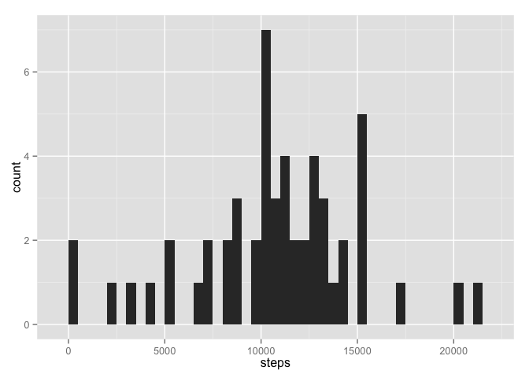
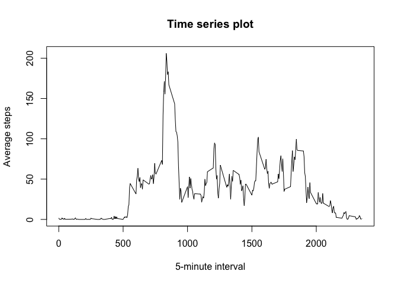
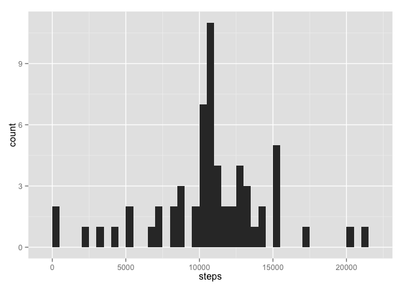

# Reproducible Research: Peer Assessment 1

## Basic setting

```r
echo = TRUE # make code visible
```

## Loading and preprocessing the data

```r
unzip ("activity.zip")
data = read.csv ("activity.csv")
```

## What is mean total number of steps taken per day?
Ignore the missing values in the dataset.
1. Make a histogram of the total number of steps taken each days

```r
library (ggplot2)
```

```
## Warning: package 'ggplot2' was built under R version 3.1.2
```

```r
totalsteps = aggregate (steps ~ date, data, sum)
qplot (steps, data = totalsteps, binwidth = 500, geom = "histogram")
```

 

2. Report the mean and median of the total number of steps taken per day

```r
mean (totalsteps$steps)
```

```
## [1] 10766.19
```

```r
median (totalsteps$steps)
```

```
## [1] 10765
```

## What is the average daily activity pattern?
1. Make a time series plot (i.e. type = "l") of the 5-minute interval (x-axis) and the average number of steps taken, averaged across all days (y-axis)

```r
average = aggregate (steps ~ interval, data, mean, na.rm = TRUE)
plot (average$interval, average$steps, type = "l",
      main = "Time series plot",
      xlab = "5-minute interval", ylab = "Average steps")
```

 

2. Which 5-minute interval, on average across all the days in the dataset, contains the maximum number of steps?

```r
average [which.max (average$steps),]
```

```
##     interval    steps
## 104      835 206.1698
```

## Imputing missing values
1. The total number of missing values in the dataset (i.e. the total number of rows with NAs)

```r
sum (is.na(data))
```

```
## [1] 2304
```

2. Fill in all of the missing values in the dataset by the mean for that 5-minute interval.

```r
ndata = data
for (i in 1:nrow(ndata)) {
        if (is.na(ndata$steps[i])) {
          ndata$steps[i] = average [which(ndata$interval[i] == average$interval), ]$steps
         }
        }
```

3. New dataset
- Make a histogram of the total number of steps taken each day

```r
library (ggplot2)
ntotal = aggregate (steps ~ date, ndata, sum)
qplot (steps, data = ntotal, binwidth = 500, geom = "histogram")
```

 

- Mean and median total number of steps taken per day

```r
mean (ntotal$steps)
```

```
## [1] 10766.19
```

```r
median (ntotal$steps)
```

```
## [1] 10766.19
```

The means estimated from the frist part and the third part are the same, but the median is different.
The impact of imputing missing data on the estimates of the total daily number of steps is not apparently big.


## Are there differences in activity patterns between weekdays and weekends?

1. Create a new factor variable in the dataset with two levels – “weekday” and “weekend” indicating whether a given date is a weekday or weekend day.

```r
ndata$days = weekdays (as.Date(ndata$date))
for (i in 1:nrow(ndata)) {
        if (ndata$days[i] %in% c("Saturday", "Sunday")) {
                ndata$days[i] = "weekend"} else {
                        ndata$days[i] = "weekday"}}
ndata$days = as.factor(ndata$days)
```

2. Make a panel plot containing a time series plot (i.e. type = "l") of the 5-minute interval (x-axis) and the average number of steps taken, averaged across all weekday days or weekend days (y-axis).

```r
meansteps = aggregate (steps ~ interval + days, ndata, mean)
library(lattice)
xyplot(meansteps$steps ~ meansteps$interval | meansteps$days, 
        layout = c(1, 2), type = "l", 
        xlab = "Interval", ylab = "Number of steps")
```

 
